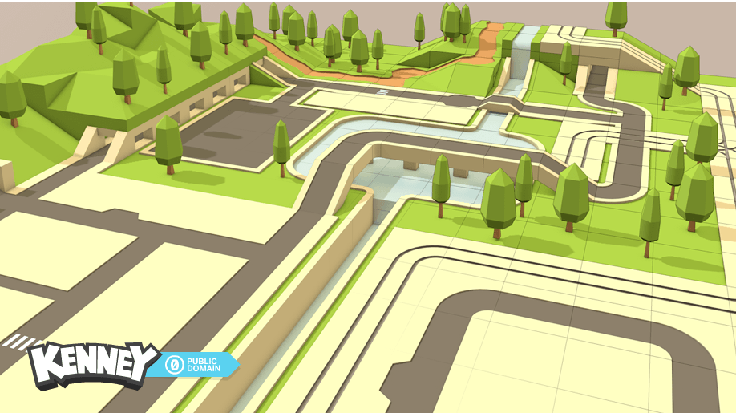

# 🛰️ 星际基地 · 沙盒建造 (Space Base Sandbox)

上帝视角的 3D 沙盒建造游戏,基于 [Three.js](https://threejs.org/) 与 [Kenney](https://kenney.nl/) 的 CC0 素材(Modular Space Kit + 3D Road Tiles)。



## ✨ 功能

- **网格吸附建造**:地板、墙体、房间、走廊、装饰按格/边线自动吸附
- **门磁吸与替换**:门自动吸附建筑边缘,对准墙体可一键替换、严丝合缝嵌入;双击可开/关(滑动门动画)
- **堆叠**:物件可往上叠层
- **道路调色板**:302 块道路瓦片按 街道 / 公路 / 路口 / 水域 / 地形 分类浏览
- **一键生成地图**:程序化生成「米黄铺装 + 蜿蜒沥青路 + 抬升草丘(密植树)+ 平地绿地 + 运河与桥」的城市地形
- **保存 / 载入 / 清空**(本地存档)
- **上帝视角相机**:WASD/中键平移、右键旋转、滚轮缩放

## 🎮 操作

| 操作 | 说明 |
|---|---|
| 左键 | 放置 |
| R | 旋转 |
| 右键点击 | 拆除 |
| 右键拖拽 | 转视角 |
| WASD / 中键 | 平移 |
| 滚轮 | 缩放 |
| 双击门 | 开 / 关 |
| Esc | 取消选择 |

## 🚀 本地运行

```bash
npm install
npm run dev
```

浏览器打开 http://localhost:5173

## 🏗️ 构建

```bash
npm run build
```

产物在 `dist/`。

## 📁 结构

```
src/          游戏源码(相机 / 建造系统 / 加载器 / 调色板 / 地图生成)
public/models 3D 模型(Space Kit .glb + Road Tiles .gltf)
index.html    入口
```

## 📜 素材授权

3D 模型来自 Kenney(kenney.nl),**CC0 公共领域**。代码开源。
